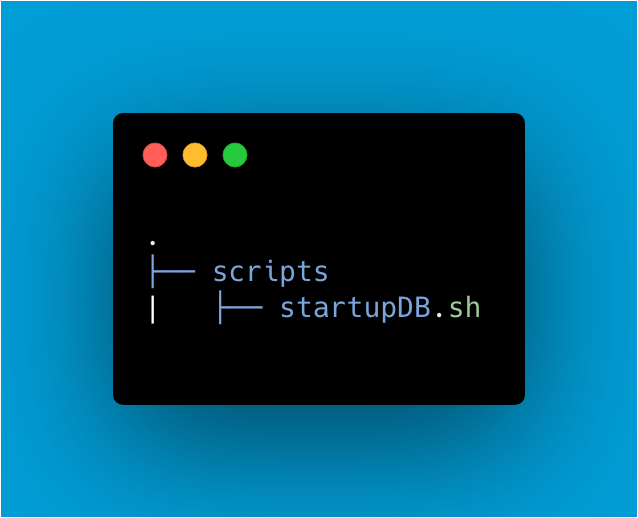
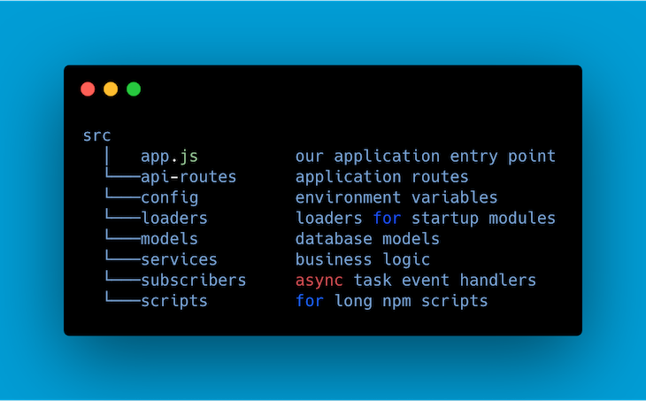

---
# try also 'default' to start simple
theme: default
# random image from a curated Unsplash collection by Anthony
# like them? see https://unsplash.com/collections/94734566/slidev
# apply any windi css classes to the current slide
class: 'text-center'
# https://sli.dev/custom/highlighters.html
highlighter: shiki
# show line numbers in code blocks
lineNumbers: true
# some information about the slides, markdown enabled
info: |
  ## Slidev Starter Template
  Presentation slides for developers.

  Learn more at [Sli.dev](https://sli.dev)
# persist drawings in exports and build
drawings:
  persist: false
---
# REST and Express

---

By the end of this section:

- Understand REST architecture
- Be able to use Express to implement REST
- Be able to compare/contrast Express with native http library
- Be able to reason about organising your code

---

# What is REST?

- Stands for Representational state transfer
- Separation of Client and Server
- Statelessness
- RESTful routes should contain the model name, HTTP method, action being performed and model ID

---

# What is Express?

A framework intended to overcome some common development challenges.

It's the most popular but not necessarily the best!

It has a large community and you can find help easily around the web.

---

# Why Express?

Really? Popularity and ease of use.

Alternatives:
- HAPI 
- fastify
- Total
- Koa

---

# Express HelloWorld

---

# Express HTTP methods and urls

---

# Express Middleware

```js
function myMiddleware(request, response, next) {
  // do something with the request
  // change the response or finish it 
  // call the next function
}
```

---

# Serving Static Files

```js
app.use(express.static("public"))
```

---
layout: two-cols
---

# Router file

In birds.js:

```js
const router = require('express').Router()

// middleware that is specific to this router
router.use(function timeLog (req, res, next) {
  console.log('Time: ', Date.now())
  next()
})
// define the home page route
router.get('/', function (req, res) {
  res.send('Birds home page')
})
// define the about route
router.get('/about', function (req, res) {
  res.send('About birds')
})

module.exports = router
```

::right::

Then, load the router module in the app:

```js
const birds = require('./birds')

// ...

app.use('/birds', birds)
```

---

# Template Engines

This is no longer a huge use case for Node but you can have Node serve your whole app, with no separate front end.

There are a number of templating engines that you combine with views/routes to generate these.

There is a list [here](https://expressjs.com/en/resources/template-engines.html) but as this is less relevant to the ecosystem these libraries have largely fallen out of use.

---
layout: two-cols
---
# Parsing and Responding with JSON

## Body Parsers

<v-clicks>

- express.json()
- express.urlencoded()

</v-clicks>

<div v-click="3">

```js
app.use(express.json())
app.use(express.urlencoded())
```
</div>

::right:: 

## Response methods
<div v-click="4">

| | |
| --- | --- |
| Method	| Description |
| res.download() |	Prompt a file to be downloaded.|
| res.end()	|End the response process. |
| res.json() |	Send a JSON response. |
| res.jsonp()	| Send a JSON response with JSONP support. |
| res.redirect() |	Redirect a request. |
| res.render() |	Render a view template. |
| res.send()	 | Send a response of various types. |
| res.sendFile() |	Send a file as an octet stream. |
| res.sendStatus() |	Set the response status code and send its string representation as the response body. |
</div>
---

# Express Application Generator

```bash
npx express-generator
```

---
layout: two-cols
---

# Project structure top tips

<v-clicks>

- Create a folder structure
- Separate business logic and API routes
- Use a service layer
- Use a config folder to organize configuration files
- Establish a scripts folder for long npm scripts

</v-clicks>




::right::




---

# Exercise

1. Refactor our http based API to Express. 

Can you:
- Extract the route into a separate file/folder
- Parse and send JSON
- 

